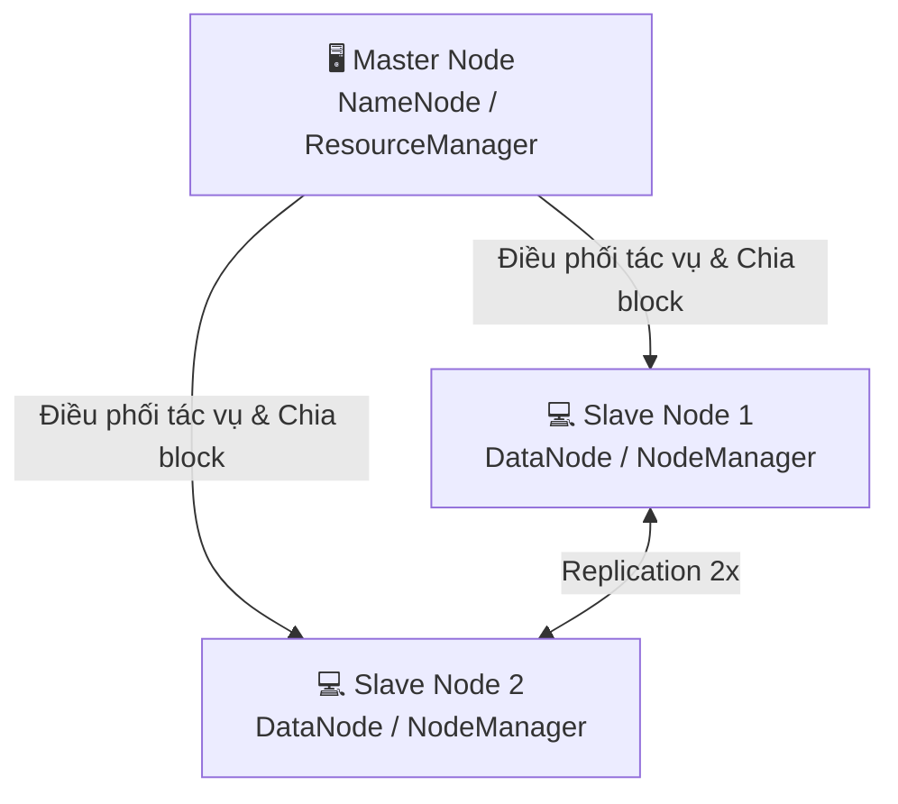

# BÁO CÁO ĐỒ ÁN KẾT THÚC HỌC PHẦN
## DỮ LIỆU LỚN VÀ ỨNG DỤNG
 
<div align="center">


 
**🏢 Đề tài: Airbnb dự báo**
 
> Giảng viên hướng dẫn: **Thầy Võ Văn Hải** &nbsp;|&nbsp; Mã lớp: **#Big Data - Chiều thứ 2** &nbsp;|&nbsp; **Nhóm 17**
 
</div>
---
 
## 📑 MỤC LỤC
 
- [Phần 1 — Giới thiệu & Thành viên](#-phần-1-giới-thiệu-dự-án--thành-viên-thực-hiện)
- [Phần 2 — Kiến trúc & Kỹ thuật](#️-phần-2-kiến-trúc-hạ-tầng--điểm-nhấn-kỹ-thuật-spark-sql)
- [Phần 3 — Vận hành & Kết quả](#-phần-3-hướng-dẫn-vận-hành--kết-quả-đạt-được)
---
 
## 👥 PHẦN 1: GIỚI THIỆU DỰ ÁN & THÀNH VIÊN THỰC HIỆN
 
Đồ án tập trung vào việc **xử lý và phân tích tập dữ liệu lớn Airbnb** dựa trên hệ sinh thái phân tán, giúp tối ưu hóa hiệu năng truy vấn vĩ mô và xây dựng mô hình dự báo trên nền tảng điện toán cụm.
 
### 📋 Danh sách thành viên & Phân chia nhiệm vụ
 
| STT | Họ và Tên | MSSV | Đóng Góp |
| :---: | :--- | :---: | :--- | :---: |
| 1 | **Nguyễn Văn A** | XXXXXXX |100% |
| 2 | **Trần Thị B** | XXXXXXX |100% |
| 3 | **Lê Văn C** | XXXXXXX |100% |
 
---
 
## 🏗️ PHẦN 2: KIẾN TRÚC HẠ TẦNG & ĐIỂM NHẤN KỸ THUẬT SPARK SQL
 
### 🔹 2.1 Sơ đồ cụm phân tán (Multi-Node Cluster)
 
Đồ án triển khai thực tế trên **3 Nodes máy chủ** kết nối mạng nội bộ (LAN) đồng bộ, cấu hình tối ưu để tận dụng tối đa sức mạnh xử lý song song:
 

 
**Công nghệ sử dụng:**
 
| Layer | Công nghệ |
|---|---|
| ☕ Runtime | Java OpenJDK 8.0 |
| 🗄️ Storage | Hadoop HDFS |
| ⚙️ Resource Manager | Hadoop YARN |
| ⚡ Compute | Apache Spark / PySpark (cluster mode) |
 
---
 
### 🔹 2.2 Điểm nhấn kỹ thuật trong 10 câu truy vấn cốt lõi
 
Hệ thống truy vấn được tối ưu hóa hiệu năng dựa trên các toán tử phân tán nâng cao của **Spark SQL Engine** nhằm giảm thiểu tối đa luồng dữ liệu truyền tải chéo giữa các máy (*Reduce Shuffle Volume*):
 
| Kỹ thuật | Mô tả |
|---|---|
| 🪟 **Window Function** | Kết hợp aggregate với phân vùng định biên `SUM(COUNT(*)) OVER (PARTITION BY...)` |
| 📐 **NTILE(3)** | Chia đều dữ liệu thành 3 phân khúc thị trường: Giá rẻ / Trung bình / Cao cấp |
| 🏆 **RANK() OVER** | Xếp hạng đa biến với sắp xếp đa tiêu chí nội bộ trong từng phân vùng hành chính |
| 🔗 **Nested CTEs** | Chuỗi bảng tạm thời liên hoàn + Scalar Subquery để bóc tách luồng vĩ mô & vi mô |
 
---
 
## 🚀 PHẦN 3: HƯỚNG DẪN VẬN HÀNH & KẾT QUẢ ĐẠT ĐƯỢC
 
### 🔹 3.1 Quy trình thực thi trên Terminal Master
 
**Bước 1 — Kích hoạt cụm phân tán Hadoop & YARN:**
```bash
start-dfs.sh && start-yarn.sh
```
 
**Bước 2 — Đồng bộ hóa môi trường hệ thống trên cả 3 Nodes:**
```bash
chmod +x scripts/setup_env.sh && ./scripts/setup_env.sh
```
 
**Bước 3 — Nạp tập dữ liệu thô vào hệ thống file phân tán HDFS:**
```bash
hadoop fs -mkdir -p /user/hadoop/airbnb/
hadoop fs -put data_sample/airbnb_sample.csv /user/hadoop/airbnb/
```
 
**Bước 4 — Submit Task xử lý 10 câu truy vấn song song sang các Slaves:**
```bash
spark-submit --master yarn --deploy-mode cluster src/spark_sql_queries.py
```
 
**Bước 5 — Huấn luyện mô hình Machine Learning phân tán với Spark MLlib:**
```bash
spark-submit --master yarn --deploy-mode cluster src/train_mllib.py
```
 
---
 
### 🔹 3.2 Kết quả & Bài học rút ra
 
<table>
<tr>
<td width="50%">
#### 🏗️ Về Hạ tầng
Làm chủ tư duy quản trị hệ thống phân tán Multi-Node Cluster, hiểu sâu cơ chế hoạt động của `Shuffle`, `Partition` và cách lập lịch tài nguyên của YARN.
 
</td>
<td width="50%">
#### 💡 Về Ứng dụng
Làm chủ các toán tử tối ưu hóa SQL trên dữ liệu lớn, xử lý mượt mà các bài toán thực tế có độ phức tạp cao — tạo tiền đề vững chắc cho việc triển khai các hệ thống Production sau này.
 
</td>
</tr>
</table>
---
 
<div align="center">
*Đồ án hoàn thành và báo cáo tại Học phần **Dữ liệu lớn và Ứng dụng***
*Giảng viên: Thầy Võ Văn Hải — Học kỳ 2 — Năm học 2025-2026*
 
</div>
