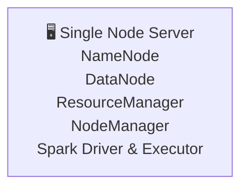

# 📊 BÁO CÁO ĐỒ ÁN KẾT THÚC HỌC PHẦN
## DỮ LIỆU LỚN VÀ ỨNG DỤNG

<div align="center">


## 🏠 ĐỀ TÀI: ỨNG DỤNG PYSPARK XÁC ĐỊNH NHÂN TỐ CỐT LÕI VÀ DỰ BÁO KHẢ NĂNG TRỞ THÀNH SUPERHOST TRÊN NỀN TẢNG AIRBNB 
**Giảng viên hướng dẫn:** TS. Võ Văn Hải  
**Lớp:** Big Data – Chiều thứ Hai  
**Nhóm:** 17

</div>

---

# 📑 MỤC LỤC

1. [Giới thiệu dự án & Thành viên thực hiện](#-1-giới-thiệu-dự-án--thành-viên-thực-hiện)
2. [Kiến trúc hạ tầng & Điểm nhấn kỹ thuật](#-2-kiến-trúc-hạ-tầng--điểm-nhấn-kỹ-thuật)
3. [Hướng dẫn vận hành & Kết quả đạt được](#-3-hướng-dẫn-vận-hành--kết-quả-đạt-được)

---

# 👥 1. GIỚI THIỆU DỰ ÁN & THÀNH VIÊN THỰC HIỆN

Đồ án tập trung vào việc **xử lý, phân tích và dự báo dữ liệu Airbnb** trên nền tảng điện toán phân tán Hadoop – Spark nhằm xác định các nhân tố ảnh hưởng đến khả năng trở thành Superhost. Hệ thống cho phép lưu trữ dữ liệu quy mô lớn trên HDFS, thực hiện truy vấn song song bằng Spark SQL và xây dựng mô hình dự báo bằng Spark ML.

## 📋 Danh sách thành viên và phân công công việc

| STT | Họ và tên | MSSV | Tỷ lệ đóng góp |
|:---:|-----------|:----:|:--------------:|
| 1 | Lê Viết Bảo | 31231025973 | 33.333% |
| 2 | Hồ Quỳnh Nga | 31221024250 | 33.333% |
| 3 | Phạm Ngọc Hồng Như | 31231022752 | 33.333% |

---

# 🏗️ 2. KIẾN TRÚC HẠ TẦNG & ĐIỂM NHẤN KỸ THUẬT

## 2.1 Kiến trúc hệ thống (Single Node Cluster)

Hệ thống được triển khai trên mô hình **Single Node Cluster**, trong đó tất cả các thành phần của Hadoop và Spark được cài đặt và vận hành trên cùng một máy chủ. Mô hình này phù hợp cho mục đích học tập, nghiên cứu và thử nghiệm các ứng dụng xử lý dữ liệu lớn, đồng thời giúp đơn giản hóa quá trình triển khai và quản trị hệ thống.



### Đặc điểm triển khai

- Toàn bộ dịch vụ Hadoop HDFS được vận hành trên một máy chủ duy nhất.
- NameNode và DataNode cùng hoạt động trên cùng hệ thống.
- ResourceManager và NodeManager được cấu hình trên cùng một node.
- Spark thực thi các tác vụ xử lý dữ liệu trực tiếp trên node cục bộ.
- Dữ liệu được lưu trữ trên HDFS và được xử lý bằng Spark SQL và Spark MLlib.

### Ưu điểm

- Dễ dàng cài đặt và cấu hình.
- Tiết kiệm tài nguyên phần cứng.
- Phù hợp cho học tập, nghiên cứu và phát triển ứng dụng thử nghiệm.
- Hỗ trợ đầy đủ các chức năng cơ bản của hệ sinh thái Hadoop – Spark.

### Hạn chế

- Không tận dụng được khả năng xử lý song song của nhiều máy chủ.
- Hiệu năng xử lý bị giới hạn bởi tài nguyên của một máy tính.
- Không có khả năng chịu lỗi như mô hình Multi-Node Cluster.


### Công nghệ sử dụng

| Thành phần | Công nghệ |
|------------|-----------|
| Runtime | Java OpenJDK 17 |
| Distributed Storage | Hadoop HDFS |
| Resource Management | Hadoop YARN |
| Processing Engine | Apache Spark |
| Programming Language | Python (PySpark) |
| Operating System | Windows |

---

## 2.2 Điểm nhấn kỹ thuật trong các truy vấn Spark SQL

Để tối ưu hiệu năng xử lý dữ liệu lớn, hệ thống áp dụng nhiều kỹ thuật nâng cao trong Spark SQL nhằm giảm thiểu chi phí Shuffle và tăng tốc độ xử lý.

| Kỹ thuật | Mô tả |
|-----------|--------|
| 🪟 Window Function | Kết hợp hàm tổng hợp theo từng phân vùng dữ liệu |
| 📐 NTILE(3) | Phân nhóm dữ liệu thành 3 phân khúc giá |
| 🏆 RANK() OVER | Xếp hạng dữ liệu theo nhiều tiêu chí |
| 🔗 Nested CTE | Sử dụng nhiều bảng tạm để tối ưu logic truy vấn |
| ⚡ Partitioning | Phân vùng dữ liệu nhằm giảm thời gian xử lý |
| 🔄 Aggregation | Tổng hợp dữ liệu quy mô lớn trên cụm Spark |

---

# 🚀 3. HƯỚNG DẪN VẬN HÀNH & KẾT QUẢ ĐẠT ĐƯỢC

## 3.1 Quy trình triển khai hệ thống

### Bước 1. Khởi động Hadoop và YARN

```bash
start-dfs
start-yarn
```

### Bước 2. Thiết lập môi trường hệ thống

```bash
chmod +x scripts/setup_env.cmd
./scripts/setup_env.
```

### Bước 3. Nạp dữ liệu vào HDFS

```bash
hadoop fs -mkdir -p /user/hadoop/airbnb/

hadoop fs -put data_sample/airbnb_sample.csv \
/user/hadoop/airbnb/
```

### Bước 4. Thực thi các truy vấn Spark SQL

```bash
spark-submit \
--master yarn \
--deploy-mode cluster \
src/spark_sql_queries.py
```

### Bước 5. Huấn luyện mô hình Machine Learning

```bash
spark-submit \
--master yarn \
--deploy-mode cluster \
src/train_mllib.py
```

---

## 3.2 Kết quả đạt được

### 🏗️ Về mặt hạ tầng

- Triển khai thành công môi trường Hadoop và Spark trên mô hình Single Node Cluster.
- Hiểu rõ cơ chế lưu trữ phân tán của HDFS.
- Nắm được quy trình quản lý tài nguyên bằng YARN.
- Thực hành xử lý dữ liệu lớn bằng Spark trên môi trường thực tế.

### 💡 Về mặt ứng dụng

- Xây dựng thành công hệ thống truy vấn Spark SQL trên dữ liệu Airbnb.
- Áp dụng các kỹ thuật tối ưu hóa truy vấn nâng cao.
- Khai thác hiệu quả các phép phân tích dữ liệu lớn.
- Huấn luyện mô hình dự báo bằng Spark MLlib trên cụm phân tán.

---

# 📌 KẾT LUẬN

Thông qua đồ án, nhóm đã tiếp cận và triển khai thành công hệ sinh thái xử lý dữ liệu lớn dựa trên Hadoop và Spark. Bên cạnh việc nắm vững kiến thức về lưu trữ phân tán và xử lý song song, nhóm còn xây dựng được quy trình phân tích và dự báo dữ liệu Airbnb trên môi trường Big Data thực tế.

---

<div align="center">

### 🎓 ĐỒ ÁN KẾT THÚC HỌC PHẦN DỮ LIỆU LỚN VÀ ỨNG DỤNG

**Giảng viên hướng dẫn:** TS. Võ Văn Hải

**Học kỳ đầu – năm 2026**

</div>
